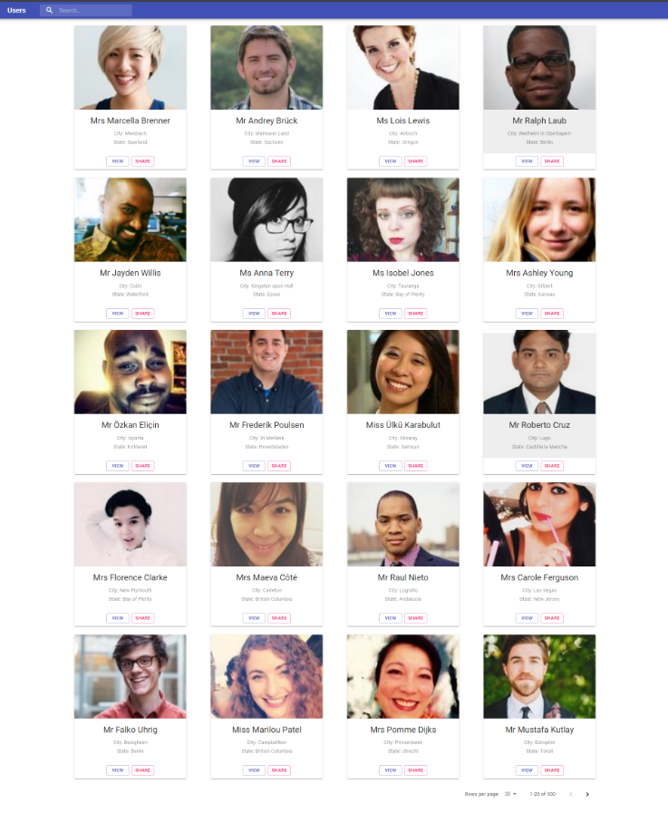

This project was bootstrapped with [Create React App](https://github.com/facebook/create-react-app).

## Available Scripts

### `npm install`

To install packages

In the project directory, you can run:

### `npm start`

Runs the app in the development mode. 
Open [http://localhost:3000](http://localhost:3000) to view it in the browser.

The page will reload if you make edits. 
You will also see any lint errors in the console.

### `npm run build`

Builds the app for production to the `build` folder. 
It correctly bundles React in production mode and optimizes the build for the best performance.

The build is minified and the filenames include the hashes. 
Your app is ready to be deployed!

See the section about [deployment](https://facebook.github.io/create-react-app/docs/deployment) for more information.

## Application Functionality

We have implemented user listing app in react with rudex, saga and material UI

- We have displayed users grid view with search and pagination functionality.
- we have displayed user details in card.
- we have added 2 view user and share user button for design purpose only we have't implemented any functionality on those button.
- We have used `create-react-app` which provide default linting tool(eslint) for code formating. (For big size commercial projects we are generally using `eslint` with `Airbnb` standards)

### Application Snapshot

